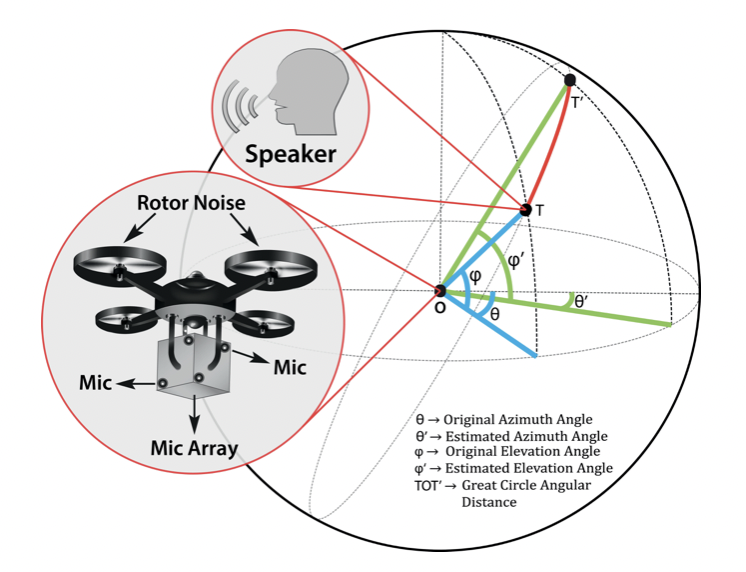

# DOANet: a deep dilated convolutional neural network approach for search and rescue with drone-embedded sound source localization
Official repository for DOANet, EURASIP Journal on Audio, Speech and Music Processing 2020

## [Paper][paper]
[paper]: http://naimulhassan.github.io/content/papers/doanet-ssl.pdf

 
<i>Dataset:</i>

[][data]

[data]: https://www.kaggle.com/datasets/alifbinabdulqayyum/dnn-prefilter-unet

          
          
</td>

Abstract: <i>Drone-embedded sound source localization (SSL) has interesting application perspective in challenging search and rescue scenarios due to bad lighting conditions or occlusions. However, the problem gets complicated by severe drone ego-noise that may result in negative signal-to-noise ratios in the recorded microphone signals. In this paper, we present our work on drone-embedded SSL using recordings from an 8-channel cube-shaped microphone array embedded in an unmanned aerial vehicle (UAV). We use angular spectrum-based TDOA (time difference of arrival) estimation methods such as generalized cross-correlation phase-transform (GCC-PHAT), minimum-variance-distortion-less-response (MVDR) as baseline, which are state-of-the-art techniques for SSL. Though we improve the baseline method by reducing ego-noise using speed correlated harmonics cancellation (SCHC) technique, our main focus is to utilize deep learning techniques to solve this challenging problem. Here, we propose an end-to-end deep learning model, called DOANet, for SSL. DOANet is based on a one-dimensional dilated convolutional neural network that computes the azimuth and elevation angles of the target sound source from the raw audio signal. The advantage of using DOANet is that it does not require any hand-crafted audio features or ego-noise reduction for DOA estimation. We then evaluate the SSL performance using the proposed and baseline methods and find that the DOANet shows promising results compared to both the angular spectrum methods with and without SCHC. To evaluate the different methods, we also introduce a well-known parameter—area under the curve (AUC) of cumulative histogram plots of angular deviations—as a performance indicator which, to our knowledge, has not been used as a performance indicator for this sort of problem before.</i>

## Citation
@article{qayyum2020doanet, 
  title={DOANet: a deep dilated convolutional neural network approach for search and rescue with drone-embedded sound source localization}, 
  author={Qayyum, Alif Bin Abdul and Hassan, KM and Anika, Adrita and Shadiq, Md and Rahman, Md Mushfiqur and Islam, Md and Imran, Sheikh Asif and Hossain, Shahruk and Haque, Mohammad Ariful and others}, 
  journal={EURASIP Journal on Audio, Speech, and Music Processing}, 
  volume={2020}, 
  number={1}, 
  pages={1--18}, 
  year={2020}, 
  publisher={SpringerOpen} 
}
